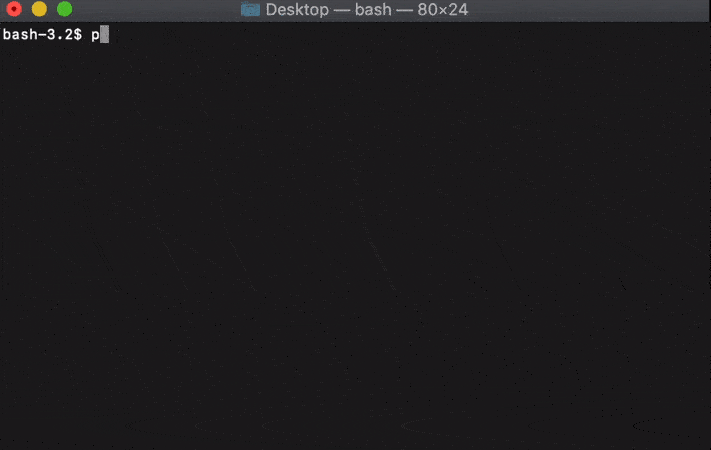

Dusty-Evolved-Star-Kit
=========================================================================================

The DESK is an SED-fitting python package for fitting data from evolved stars (photometry or spectra) with radiative transfer model grids. The package is currently in development and all contributions are welcomed. For current progress, see the Issues tab at the top of the page. The package is ideal for fitting small samples of dusty evolved stars. It will soon utilize a bayesian-fitting strategy with mass-loss rate and luminosity distributions as inputs (priors), and will provide a better fit  to these broader sample properties.

**Input**: A csv file with the first column as wavelength in um and second column as flux in Jy. To fit multiple csv files, put them in a directory, and use the directory name as the input.

**Output**: A csv files with the best fit model and corresponding stellar parameters, as well as an optional figure of the fit SED.

**Available model grids**:
Several grids are **already available** upon installation. A range of other model grids, including 2D [GRAMS](https://ui.adsabs.harvard.edu/abs/2011ApJ...728...93S/abstract) model grids based on the [2DUST](https://ui.adsabs.harvard.edu/abs/2003ApJ...586.1338U/abstract) code, and state-of-the-art dust-growth models by [Nanni et al. (2019)](https://ui.adsabs.harvard.edu/abs/2019MNRAS.487..502N/abstract), are downloaded automatically and used when selected. Descriptions of the [model grids](https://dusty-evolved-star-kit.readthedocs.io/en/latest/grids.html) can be found in the documentation.

A module for creating your own [DUSTY](https://github.com/ivezic/dusty) grid is under development, but for now, please email me ([Dr. Steven Goldman](http://www.stsci.edu/~sgoldman/)) directly for potential grid requests or for help with the package.

Documentation
-------------

The documentation can be found on [readthedocs](http://dusty-evolved-star-kit.readthedocs.io/en/latest/).

Install Using Python
--------------------

1). Install the package from [source](https://dusty-evolved-star-kit.readthedocs.io/en/latest/installation.html) or with [pip](https://pypi.org/project/pip/) using the command `pip install desk`.

Using the DESK
--------------

2). Go to the directory where your target csv file (or target directory of files) is.  

3). Use the following command in any terminal (or use the [instructions for python](https://dusty-evolved-star-kit.readthedocs.io/en/latest/usage.html#use-in-python-environment))

  `desk fit --source='target_name.csv'`

or if you have a folder of csv files

  `desk fit --source='folder_of_csvs'`

To fit the example sources use the command

  `desk fit`

additional options are:

`desk fit --source='target_name.csv' --distance=50 --grid='Oss-Orich-bb'`

The other important options are the distance (in kpc) and the grid of models you would like to use (options listed below). For other options see the [Usage](https://dusty-evolved-star-kit.readthedocs.io/en/latest/usage.html) page. For the model grids, you can select 'oxygen' or 'carbon' to use the default models. To see other available grids use:

`desk grids`

To create a figure showing all of the fits of the SED, use the following command in the same directory.

`desk sed`

This is an example of the output_sed.png file fitting three massive oxygen-rich AGB stars from the LMC.

To produce individual figures for each SED instead use the command:

`desk sed_indiv`

The package can also be used within python (see the [docs](https://dusty-evolved-star-kit.readthedocs.io/en/latest/usage.html#use-in-python-environment)).

Retrieve Photometry
-------------------

Don't have the photometry? You can retrieve them from *Vizier* using the [vizier_sed](https://dusty-evolved-star-kit.readthedocs.io/en/latest/usage.html#use-in-python-environment) command if you have the source name or position in degrees:

`desk vizier_sed 'MSX LMC 807'`

or

`desk vizier_sed '(83.15482600, -67.11567600)'`

Afterwords, you can fit that data with the command:

`desk fit --source='MSX_LMC_807_sed.csv'`

Citation
-----------

Goldman, S. R. 2020, Journal of Open Source Software, 5, 2554, doi: 10.21105/joss.02554

or with bibtex:

<pre>@article{Goldman2020,
  doi = {10.21105/joss.02554},
  url = {https://joss.theoj.org/papers/10.21105/joss.02554},
  year = {2020},
  publisher = {The Open Journal},
  volume = {5},
  number = {54},
  pages = {2554},
  author = {Steven R. Goldman},
  title = {The Dusty Evolved Star Kit (DESK): A Python package for fitting the Spectral Energy Distribution of Evolved Stars},
  journal = {Journal of Open Source Software}
}</pre>

Please also specify the options selected and make the data publicly available for reproducibility.

License
-------

This project is Copyright (c) [Dr. Steven Goldman](https://s-goldman.github.io/) and licensed under the terms of the BSD 3-Clause license.
