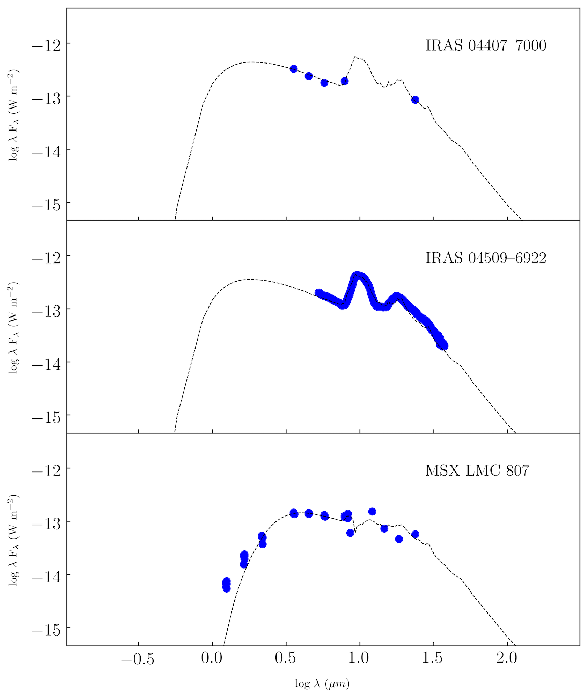

Dusty-Evolved-Star-Kit
=========================================================================================

[![Build][(https://github.com/s-goldman/Dusty-Evolved-Star-Kit/workflows/Python%20package/badge.svg?branch=master)](https://github.com/s-goldman/Dusty-Evolved-Star-Kit/actions)

The DESK is an SED-fitting python package for fitting data from evolved stars (photometry or spectra) with radiative transfer model grids. The package is currently in development and all contributions are welcomed. For current progress, see the Issues tab at the top of the page. The package is ideal for fitting small samples of dusty evolved stars. It will soon utilize a bayesian-fitting strategy with mass-loss rate and luminosity distributions as inputs (priors), and will provide a better fit  to these broader sample properties.

**Input**: A csv file with the first column as wavelength in um and second column as flux in Jy. To fit multiple csv files, put them in a directory, and use the directory name as the input.

**Output**: Two results files including the best fit model and corresponding stellar parameters, as well as an optional figure of the fit SED.

**Available model grids**:
Several grids are **already available** upon installation. Descriptions of the model grids can be found in the [Documentation](https://dusty-evolved-star-kit.readthedocs.io/en/latest/grids.html). You will soon be able to specify the state-of-the-art dust growth models by [Nanni et al. (2019)](https://ui.adsabs.harvard.edu/abs/2019MNRAS.487..502N/abstract) and the 2D [GRAMS](https://2dust.stsci.edu/grams_models.cgi) model grid based on the [2DUST](https://2dust.stsci.edu/index.cgi) code, which are automatically downloaded and used when selected.

A module for creating your own [DUSTY](https://github.com/ivezic/dusty) grid is under development, but for now, please email me ([Dr. Steven Goldman](http://www.stsci.edu/~sgoldman/)) directly for grid requests or for help with the package.

Documentation
-------------

The documentation can be found on [readthedocs](http://dusty-evolved-star-kit.readthedocs.io/en/latest/).

Install Using Python
-------------------

1). Install the package with the command `pip install desk`.

Using the DESK
-------------------

2). Go to the directory where your target csv file (or target directory of files) is.  

3). Use the command (without starting python)

  `desk fit --source='target_name.csv'`

or if you have a folder of csv files

  `desk fit --source='folder_of_csvs'`

additional options are:

`desk fit --source='target_name.csv' --distance=50 --grid='Oss-Orich-bb'`

These additional arguments are the distance (in kpc) and the grid of models you would like to use (options listed below). You can select 'oxygen' or 'carbon' to use the default models. To see other available grids use:

`desk grids`

This is an example of the output_sed.png file fitting three massive oxygen-rich AGB stars from the LMC. To produce individual figures subsequently run the command:

`desk single_fig`

Attribution
-----------

The method used is similar to that of [Goldman et al. 2017](https://ui.adsabs.harvard.edu/abs/2017MNRAS.465..403G/abstract); a more in-depth publication is in prep. If used please add the following to your acknowledgements:

This research has made use of the Dusty Evolved Star Kit (DESK; <https://github.com/s-goldman/Dusty-Evolved-Star-Kit>).

Please also specify the options selected and make the data publicly available for reproducibility.

License
-------

This project is Copyright (c) [Dr. Steven Goldman](http://www.stsci.edu/~sgoldman/) and licensed under
the terms of the BSD 3-Clause license.
