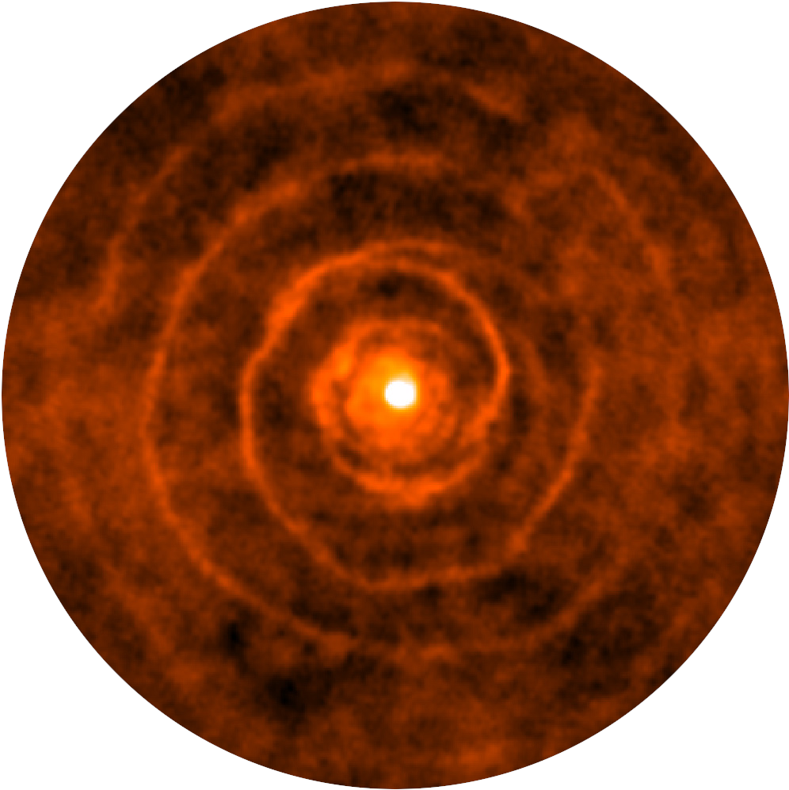

Dusty-Evolved-Star-Kit
======================

Under Development!

SED-fitting python scripts for fitting data from evolved stars (photometry or spectra) with [DUSTY](https://github.com/ivezic/dusty) 1-D radiative transfer models. Package contains scripts for:
1. Running DUSTY in a multiprocessing batch mode
2. Converting the output from DUSTY to two fits files
3. Least square fitting of the models to data
4. Plotting the results

**Input**: csv with first column wavelength in um and second column flux in Jy (File can have other columns).

**Output**: Results file with best fit model, as well as a results file with specifics for plotting the output. 

**Options**: In the sed_fitting.py you can specify:
 * The model grid
 * distance (in kpc)
 * the wavelength range to fit
 * normalizations range to try
 * the number of values in that normalization range

Several grids are in the models directory (change using the model_grid variable), but you can also create your own model grid.

1. Run dusty
2. Put all outputs (spectra files .s* and output files *.out) into a directory of the same name (see example grid directories)
3. Run the dusty_to_grid.py script

This will create two fits files containing all spectra (*directoryname*_models.fits), and all outputs (*directoryname*_outputs.fits).

Documentation
-------------

The documentation will soon be found on [readthedocs](http://dusty-evolved-star-kit.readthedocs.io/en/latest/)

Installing the DESK
-------------------

The package is pip installable, just type `pip install desk` in any terminal. You can also clone the github repository using `git clone https://github.com/s-goldman/Dusty-Evolved-Star-Kit.git`. 

Creating a model grid with DUSTY
--------------------------------
In development

Fitting with the DESK
----------------------

All of the important script files can be found in "/dusty-evolved-star-kit/python_scripts"

Just add the csv data files you want to fit to the *put_target_data_here* directory, select your options (shown above) within the sed_fitting.py script, and then run sed_fitting.py in python.

Attribution
-----------

The method used is similar to that of [Goldman et al. 2017](http://adsabs.harvard.edu/abs/2016arXiv161005761G).

Acknowledgements
----------------

I would like to thank Sundar Srinivasan for helping to vastly improve the fitting technique, Ben Sargent for sharing his wisdom of dust optical constants, and Nate Miles and Matthew Bourque for their help with the interpolation of the model grids. 

License
-------

This project is Copyright (c) [Dr. Steven Goldman](http://www.stsci.edu/~sgoldman/) and licensed under
the terms of the BSD 3-Clause license.
