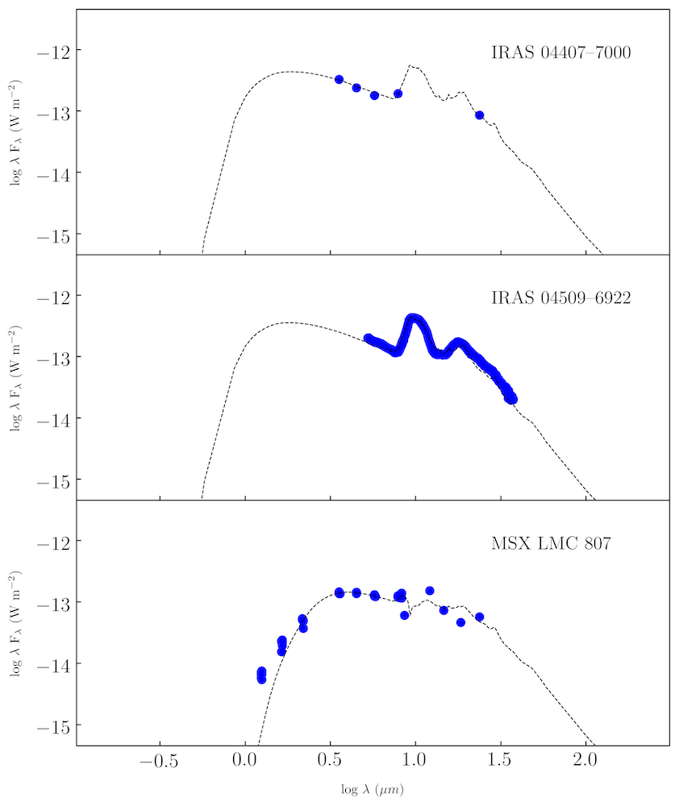

=====
Usage
=====

SED-Fitting
-----------

The Dusty-Evolved-Star-Kit can fit the spectra and photometry of evolved stars with both carbon- and oxygen-rich grids of radiative transfer models. This enables easy comparison of grids of models and different samples.

The input for this package is a csv file with wavelength in microns in the first column, and flux in Jy in the second column.

After installation with pip, in any command line prompt, use the command:

.. code-block:: console

	> desk grids

This will display the available grids for fitting. Next you need to point the package to your csv file, and specify the distance and grid of choice:

.. code-block:: console

	> desk fit --source='target_name.csv' --distance=50 --grid='H11-LMC'

or specify a directory with multiple csv files:

.. code-block:: console

	> desk fit --source='folder_of_csvs' --distance=30 --grid='Oss-Orich-bb'

Outputs
-------

This is an example of the output_sed.png file fitting three massive oxygen-rich AGB stars from the LMC. To produce individual figures subsequently run the command:

.. code-block:: console

	> desk single_fit

Retrieve Single Model from Grid
-------------------------------

The DESK can also be used to easily access radiative transfer models from the grids, and interpolate models and their corresponding outputs.

To retrieve a model grid, enter the following command with the desired effective temperature (Teff), inner dust temparature (Tinner), and optical depth (odep):

.. code-block:: console

	> desk get_model model_grid_name Teff Tinner Odep

For example:

.. code-block:: console

	> desk get_model Oss-Orich-aringer 2800 600 0.176

Where a model exists in this parameter range, the DESK will retrieve an save a csv file of the model spectra and print the mass-loss rate and expansion velocity. Where the desired parameters are between grid points, an interpolated model grid will be created and saved.
