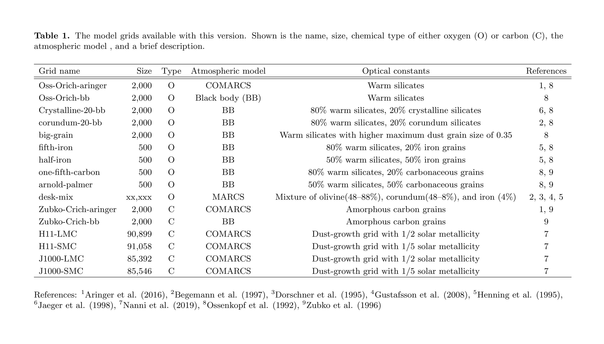

# Summary

One of the few ways that we can understand the environment around dusty stars and how much material they contribute back to the Universe, is by fitting their brightness at different wavelengths with models that account for how the energy transfers through the dust. Codes for creating models have been developed and refined [@Elitzur:2001; @Ueta:2003], but a code for easily fitting data to grids of realistic models has been up-to-this-point unavailable.

The ``DESK`` is a python package designed to compare the best fits of different stellar samples and model grids for a better understanding of the results and their uncertainties. The package fits the Spectral Energy Distribution (SED) of evolved stars, using photometry or spectra, to grids of radiative transfer models using a least-squares method. The package includes newly created grids using a variety of different dust species, and state-of-the-art dust growth grids [@Nanni:2019]. Early versions of the code have been used in [@Orosz:2017; @Goldman:2017; @Goldman:2018; @Goldman:2019b]

# Statement of need

To understand the ranges and estimated errors of fitted results, they must be compared to results from different model grids. Results from these grids (e.g. luminosity, mass-loss rate) can vary dramatically as a result of the unknown dust properties and geometry of evolved stars [@Sargent:2010; @Srinivasan:2011; @Wiegert:2020]. This is especially true of the oxygen-rich Asymptotic Giant Branch (AGB) stars. Adding to this challenge is the fact that models are calculated based on measured values of the dust (optical constants) which can not be interpolated over. A robust method for testing different model grids will be particularly important given the wealth of infrared data to come from the James Webb Space Telescope (JWST).

# User interface

The package can be installed using `pip` and imported within python. Using "entrypoints", the package can also be accessed from any terminal prompt once installed. The fitting method uses a brute-force technique to ensure a true best fit. New grids of multi-dimensional radiative transfer models will be added to the model grid library as they are developed. The available model grids for this version are listed in Table 1.

# Figures

---
nocite: |
  @Aringer:2016, @Begemann:1997, @Henning:1995, @Jaeger:1998, @Ossenkopf:1992, @Zubko:1996
---

# References
